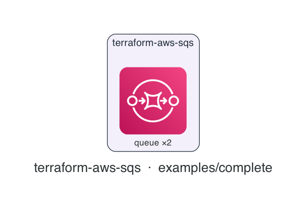

# terraform-aws-sqs

[](https://github.com/devotica-labs/terraform-aws-sqs/actions/workflows/ci.yml)
[](https://github.com/devotica-labs/terraform-aws-sqs/actions/workflows/release.yml)
[](LICENSE)

> Part of the **Devotica** Terraform catalog. Follows the cloudposse module standard (README.yaml-driven docs, the `enabled`/`namespace`/`environment`/`stage`/`name`/`attributes`/`tags`/`label_order` label surface, `examples/complete`, Makefile targets) implemented **natively** — no external naming or build-harness dependencies.

## Introduction

Terraform module for an **Amazon SQS** queue — standard or FIFO — with server-side encryption always on and an optional dead-letter queue. It ships fintech-safe defaults so a queue is encrypted and TLS-enforced out of the box.

Defaults are opinionated: **server-side encryption on** (SQS-managed SSE by default, SSE-KMS when you supply a key), an **optional dead-letter queue** wired via a redrive policy, and — whenever an access policy is attached — a **deny for any non-TLS request**.

## Architecture

<!-- BEGIN_ARCH -->



<sub>Generated by `.github/workflows/architecture-diagram.yml` on every push to main. Do not edit the image by hand — change the Terraform code in `examples/complete/` and the bot will regenerate it.</sub>

<!-- END_ARCH -->

## Usage

```hcl
module "sqs" {
  source  = "devotica-labs/sqs/aws"
  version = "~> 0.1"

  namespace = "dvtca"
  stage     = "prod"
  name      = "events"       # queue → dvtca-prod-events

  # A dead-letter queue after 5 failed receives.
  max_receive_count = 5

  # Fintech defaults cover encryption (SQS-managed SSE) and TLS enforcement.
  tags = local.tags
}
```

A FIFO queue with a customer-managed KMS key and a grant to producer/consumer roles:

```hcl
module "sqs" {
  source  = "devotica-labs/sqs/aws"
  version = "~> 0.1"

  namespace = "dvtca"
  stage     = "prod"
  name      = "payments"     # queue → dvtca-prod-payments.fifo

  fifo_queue        = true
  kms_master_key_id = module.kms.key_arn
  max_receive_count = 5

  # Grants sqs:SendMessage / sqs:ReceiveMessage and denies non-TLS access.
  policy_principals = [
    "arn:aws:iam::111122223333:role/payments-producer",
    "arn:aws:iam::444455556666:role/payments-consumer",
  ]
}
```

See [`examples/basic`](examples/basic) and [`examples/complete`](examples/complete).

## Defaults that matter

| Setting | Default | Why |
|---------|---------|-----|
| `sqs_managed_sse_enabled` | `true` | Server-side encryption is always on; supply `kms_master_key_id` to switch to SSE-KMS. |
| `visibility_timeout_seconds` | `30` | AWS default in-flight window before a message becomes receivable again. |
| `message_retention_seconds` | `345600` (4 days) | Undelivered messages are retained for four days. |
| `max_receive_count` | `0` (no DLQ) | A dead-letter queue is created only when you set a redrive threshold. |
| queue policy | attached only with `policy_principals` | When present it grants Send/Receive and **denies any non-TLS request**. |

## How this fits the Devotica catalog

Producers and consumers running under `terraform-aws-ecs-fargate` or `terraform-aws-eks-*` reach this queue — pass their execution roles into `policy_principals` to grant Send/Receive. Supply a key from `terraform-aws-kms` as `kms_master_key_id` for customer-managed encryption.

## Makefile Targets

```
make fmt       # terraform fmt -recursive
make validate  # terraform init -backend=false && terraform validate
make test      # terraform test (unit + contract; integration needs AWS creds)
make readme    # regenerate the terraform-docs block below
```

<!-- BEGIN_TF_DOCS -->
<!-- terraform-docs regenerates this block via `make readme` / CI. Inputs and
     outputs are documented in variables.tf and outputs.tf. -->
<!-- END_TF_DOCS -->

## License

[Apache 2.0](LICENSE) © Devotica
